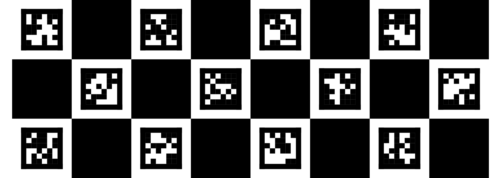

# A2Vec TagBoard

A2Vec 电子标定板：把手机屏幕变成一块可测量的 AprilTag 标定板。

原生 Android，横屏全屏、屏幕常亮，按设备真实 DPI 逐像素重绘板面，并通过局域网
HTTP 接口输出板面的几何参数与位图，供上位机直接使用。浏览器无法提供屏幕的绝对
物理尺寸，所以这里采用原生实现。



## 规格

| 项 | 值 |
|---|---|
| 布局 | `classic-12`（3 行 × 4 列，默认） / `compact-6`（2 行 × 3 列，单个 tag 更大） |
| 图案 | AprilTag `tag36h11`；tag 在棋盘格内居中，黑框 : 格距 = 165 : 236，交错排布 |
| 屏幕 | 横屏、全屏、常亮；四边带 1 / 5 / 10 mm 毫米刻度 |
| 尺寸 | `tag_size_m = 165 × boardScale / pxPerMm / 1000`，`boardScale` 按视图真实尺寸计算 |
| 接口 | `0.0.0.0:8899`（HTTP），支持 USB（`adb forward`）与局域网 |
| 平台 | Android 7.0+（minSdk 24 / targetSdk 34） |
| 依赖 | 无第三方库，不使用 Gradle |

屏幕 DPI 由系统提供，属估计值；投入正式采集前建议实测黑框边长确认。

## 接口

| 端点 | 说明 |
|---|---|
| `GET /tagboard.json` | 全部参数：屏幕 px/mm、xdpi/ydpi、板几何、tag ids、centers_m、tag_size_m |
| `GET /tagboard/params` | 标定所需的最小参数集 |
| `GET /tagboard/board.png` | 设备实际渲染的板面位图 |
| `POST /tagboard/layout?layout=compact-6` | 切换布局并返回新参数 |
| `POST /tagboard/pose` | 回传相机位姿，供屏幕显示核对 |
| `GET /health` | 存活检查 |

```bash
adb forward tcp:8899 tcp:8899
curl -s http://127.0.0.1:8899/tagboard/params | python3 -m json.tool
```

`centers_m` 以 tag1 中心为原点，单位米，导出为 `[向右, 0, 向上]`；奇数行带横向错位，由布局决定。

## 构建

```bash
./build.sh          # 产物 build/TagBoard.apk
```

依赖 Android SDK 的 `build-tools/34.0.0` 与 `platforms/android-34/android.jar`
（默认在 `$HOME/android-sdk`，可用 `ANDROID_SDK_HOME` 覆盖），以及 JDK 21。

## 安装

```bash
adb install -r build/TagBoard.apk
```

横屏全屏运行。点击屏幕重新进入沉浸式；长按切换 12 / 6 个 tag。

## 验证

`verify_render.py` 编译并运行 app 的真实源码（`BoardSpec` + `tools/RenderMain`）渲染板面，
再用 `pupil_apriltags` 检出，核对编号、hamming 与中心位置，覆盖 2800 / 2156 / 1920 / 1260 / 1080 五种屏宽。

```bash
python3 verify_render.py                # classic-12
python3 verify_render.py --layout compact-6
```

判据：classic 12/12、compact 6/6，hamming 全 0，tag 中心与格中心偏差 < 1 px。

`check_physical.py` 用相机实测的 tag 像素反推物理尺寸，与 app 按 xDpi 计算的结果交叉比对：

```bash
A2VEC_CAMERAS=/path/to/cameras.json python3 check_physical.py
```

需要腕部相机内参（`cameras.wrist.color_intrinsics`，取 `[0][0]` 作为 fx）。

## 目录

```
AndroidManifest.xml            横屏、全屏、常亮
build.sh                       aapt2 + javac + d8 + zipalign + apksigner
res/values/                    主题与字符串
src/com/a2vec/tagboard/
  BoardSpec.java               几何常量与 12 个 tag36h11 图案（纯 Java，可离线复用）
  TagBoardView.java            板面位图、毫米刻度、状态行
  CalibServer.java             8899 端口上的 HTTP 服务
  MainActivity.java            DPI 读取、沉浸式、常亮、布局持久化
tools/RenderMain.java          离线渲染 PGM，供 verify_render.py 使用
verify_render.py               渲染口径验证
check_physical.py              物理尺寸交叉验证
docs/                          板面渲染图
```

## 许可

MIT，见 [LICENSE](LICENSE)。

图案为 AprilTag `tag36h11` 家族（[AprilRobotics/apriltag](https://github.com/AprilRobotics/apriltag)，BSD-2-Clause）；
检测侧可直接使用 [pupil-apriltags](https://github.com/pupil-labs/apriltags)（MIT）。
